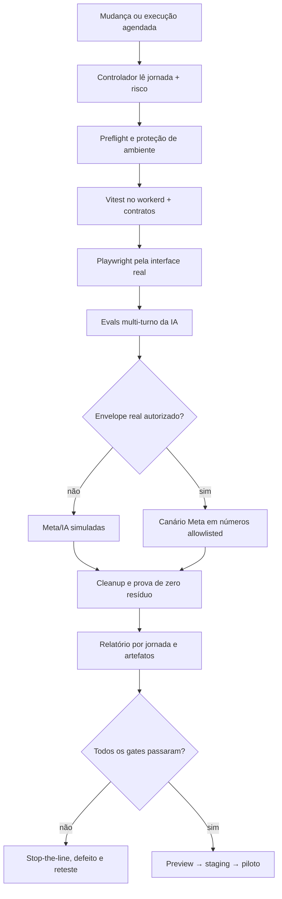

# Plano de confiabilidade e piloto autônomo — SmartZap

Data da pesquisa e do diagnóstico: 29/07/2026  
Produto: SmartZap em Cloudflare Workers, D1, Queues, Durable Objects, Workflows, React, Meta Cloud API e IA  
Objetivo: sair do ciclo “corrige, publica e descobre outro bug” e chegar a um piloto real, limitado, observável e testado autonomamente.

## Veredito executivo

O SmartZap ainda não está pronto para uso irrestrito por clientes, mas já tem base suficiente para entrar em um piloto controlado depois de uma sprint de confiabilidade.

O ativo mais valioso já existe: o produto possui catálogo de jornadas, testes no runtime de Workers, Playwright em três motores, travas de piloto, idempotência de webhooks e uma integração real Meta ↔ Inbox/IA comprovada. O problema é que essas peças não estão ligadas por um único gate de qualidade.

Hoje há quatro fontes distintas de “verdade”:

1. testes Vitest;
2. suíte Playwright;
3. scripts E2E/visuais avulsos;
4. auditorias manuais e ensaios reais com Meta/WAHooks.

Uma camada pode ficar verde enquanto outra continua quebrada. A solução é criar um plano de controle único que só libera uma versão quando todas as evidências exigidas para as jornadas afetadas estão presentes.

## Estado real encontrado

| Sinal | Estado em 29/07/2026 | Leitura |
| --- | --- | --- |
| Vitest/Workers | 49 arquivos e 397/397 testes aprovados | Boa base determinística, mas o binding de Workers AI é remoto e pode gerar uso/custo |
| TypeScript | `npx tsc --noEmit` aprovado | Tipos verdes |
| Build | aprovado | Há aviso de chaves de Meta Flow ausentes; o pós-build remove `.dev.vars` |
| Playwright | 129 testes enumerados em Chromium, Firefox e WebKit | Não executados integralmente nesta pesquisa; a última evidência completa registrada foi 126/126 em 19/07 |
| Catálogo | 80 jornadas | 49 aprovadas, 18 em reteste, 7 em teste, 2 bloqueadas, 1 não testada e 3 fora do escopo |
| Scripts fora do gate | 19 scripts E2E/visuais | Cobertura importante sem relatório ou aprovação unificados |
| CI/CD | push em `main` testa, migra D1 remoto e publica direto | Não há preview, staging, canário nem rollback automatizado |
| Browsers no CI | instala somente Chromium, mas o config solicita três motores | Inconsistência objetiva do pipeline |
| Isolamento | D1 compartilhado e suíte serial | Já houve contaminação entre fixture e dado real/mais recente |
| Git | `main` com 81 arquivos modificados e 181 não rastreados | O produto atual não possui um baseline imutável e recuperável no Git |
| Meta real | transporte, entrega e uma resposta por IA já comprovados | Multi-turno, política de ambiguidade e qualificação limpa continuam pendentes |

### Riscos que impedem um piloto irrestrito

1. **Não existe baseline recuperável.** O código atual está muito além do último commit. Sem checkpoint, não existe rollback confiável.
2. **A evidência envelhece sem ser invalidada.** Uma jornada pode continuar “aprovada” mesmo depois de mudanças profundas em arquivos que a afetam.
3. **O deploy é uma linha reta até produção.** Migração e publicação ocorrem sem staging, canário ou teste pós-deploy bloqueante.
4. **Testes de IA podem tocar recurso remoto.** A Cloudflare informa que Workers AI não possui simulação local; chamadas de teste podem consumir o serviço.
5. **Cobertura avulsa não bloqueia release.** Scripts importantes não participam de `npm run e2e` nem do deploy.
6. **O teste real da Meta ainda é artesanal.** IDs, timeline, retries, limpeza e critérios de parada não são consolidados automaticamente.
7. **A IA não possui uma suíte de negócio contínua.** Houve ensaios reais bons, mas ainda não existe um dataset versionado com múltiplas tentativas, graders e regressão.

## Decisão estratégica

Congelar novas features e redesigns por 10 dias úteis. Nesse período, só entram:

- correções de confiabilidade, segurança e observabilidade;
- isolamento de testes;
- automação das jornadas P0/P1;
- criação do ambiente de staging;
- preparação e execução do piloto.

O objetivo não é “zero bugs”. O objetivo é impedir que um bug crítico atravesse a mesma barreira duas vezes.

## Modelo de risco do SmartZap

### P0 — pode enviar, vazar, cobrar, perder ou corromper

- autenticação e autorização;
- segredos, webhook e assinatura HMAC;
- consentimento, opt-in, opt-out e supressão;
- campanha, destinatário, template, variáveis e envio;
- idempotência, retry, status e reconciliação;
- Inbox e automação de IA;
- isolamento entre contatos/conversas;
- kill switches;
- exclusão e migração;
- integrações Meta reais.

Gate: 100% aprovado, zero flake e evidência compatível com o tipo da jornada.

### P1 — operação essencial sem efeito externo irreversível

- contatos, importação e segmentação;
- templates e projetos;
- dashboard, performance e configurações;
- conhecimento, agentes e atendentes;
- formulários e submissões;
- responsividade e acessibilidade das rotas críticas.

Gate: 100% das jornadas críticas aprovadas e no mínimo 99% da suíte geral, sem falha não classificada.

### P2 — conveniência ou expansão

- preview visual;
- variações editoriais;
- funcionalidades experimentais;
- Meta Flows dinâmicos e Google Calendar enquanto bloqueados;
- itens explicitamente fora do escopo.

Gate: não bloqueia o piloto quando está isolado, sem UI morta e sem API mutável indevida.

## Arquitetura do teste autônomo



### Quatro ambientes, quatro níveis de verdade

| Ambiente | Provedores | Dados | Pode enviar externamente? | Finalidade |
| --- | --- | --- | --- | --- |
| Local determinístico | Meta, IA e Calendar falsos | D1/R2/Queues locais e efêmeros | Não | unidade, contrato, integração e UI rápida |
| Preview por PR | serviços Cloudflare isolados | fixture exclusiva por `run_id` | Não | jornada real em deployment isolado |
| Staging | Workers AI real e número de teste Meta | conta/instalação sintética | Somente envelope allowlisted | canário, integração e soak |
| Produção | reais | reais | Não por testes automáticos comuns | smoke read-only e piloto humano/controlado |

Regra: nenhum teste mutante prossegue se detectar URL, IDs ou recursos de produção sem a flag explícita de canário real.

## Fase 0 — preservar e criar a fonte da verdade

Prazo: primeiro dia.

1. Parar mudanças visuais e de feature.
2. Criar um checkpoint não destrutivo do estado atual em uma branch própria.
3. Excluir do checkpoint segredos, caches, `.DS_Store`, artefatos e credenciais.
4. Executar baseline completo e registrar versão, ambiente e resultados.
5. Criar `qa/journeys.yml`, sem substituir `jornada.md`, contendo:

```yaml
CMP-04:
  risk: P0
  owners: [campaigns]
  tests:
    - tests/campaigns.test.ts
    - e2e/smoke.spec.ts
  evidence:
    - api
    - ui
    - meta-canary
  invalidated_by:
    - src/api/campaigns.ts
    - src/workflows/CampaignSendWorkflow.ts
    - app/pages/CampaignNew.tsx
```

6. Toda mudança passa a reabrir automaticamente as jornadas dependentes. “Aprovada” recebe versão e data de validade.
7. Começar uma nova entrada em `Auditoria.md` apenas quando a execução real deste plano iniciar.

### Gate da fase

- baseline recuperável;
- zero segredo incluído;
- 100% das jornadas P0/P1 mapeadas a testes e evidências;
- cada item “aprovado” possui evidência atual, não apenas histórica.

## Fase 1 — isolamento determinístico

Prazo: dias 2 e 3.

### Trabalho necessário

1. Criar interfaces explícitas para `MetaProvider`, `AIProvider`, `CalendarProvider` e relógio.
2. Usar providers falsos por padrão em Vitest e Playwright.
3. Remover o binding real de Workers AI da suíte determinística. Workers AI não tem simulação local e deve existir somente em staging controlado.
4. Dar a cada execução:
   - `run_id` único;
   - prefixo `AUTOQA_<data>_<id>`;
   - contatos, campanhas, templates e conversas próprios;
   - relógio controlável;
   - cleanup por IDs exatos.
5. Parar de resolver contaminação apenas serializando. Primeiro isolar storage e fixtures; paralelismo só volta depois.
6. Testar Queues, Workflows e webhooks com:
   - duplicidade;
   - ordem invertida;
   - timeout;
   - `429`;
   - `5xx`;
   - retry parcial;
   - DLQ;
   - replay;
   - idempotência.
7. Um cleanup falho reprova a execução.

### Gate da fase

- zero chamada de IA/Meta/Calendar real no gate local;
- zero fixture compartilhada entre testes;
- zero dado residual;
- repetição de três execuções com o mesmo resultado;
- nenhum P0 passa apenas após retry.

## Fase 2 — um único painel de qualidade

Prazo: dias 3 a 5.

### Comandos finais

```text
npm run qa:preflight       tipos, build, diff, segredos e ambiente
npm run qa:unit            Vitest/workerd
npm run qa:contract        Meta, webhook, IA, Queue e schemas
npm run qa:e2e:p0          Chromium, mobile e desktop, em PR
npm run qa:e2e:matrix      Chromium, Firefox e WebKit
npm run qa:visual          360, 390, 620, 768, 1440 e 1920
npm run qa:ai              dataset multi-turno e graders
npm run qa:meta:canary     somente staging e allowlist
npm run qa:cleanup         prova de zero resíduo
npm run qa:all             controlador e relatório consolidado
```

Os 19 scripts avulsos devem virar testes/reporter do mesmo sistema ou ser removidos. Nenhum script relevante pode continuar como conhecimento tribal.

### Configuração Playwright

- `forbidOnly: true` no CI;
- `trace: "on-first-retry"` ou `retain-on-failure`;
- screenshot e vídeo somente em falha;
- reporter HTML, JUnit e JSON;
- artefatos privados e sanitizados;
- zero retry local;
- um retry no CI apenas para capturar diagnóstico;
- qualquer resultado `flaky` em P0/P1 continua reprovando o release;
- instalação de todos os browsers usados pelo config;
- projects separados para PR rápido, matriz noturna, staging e smoke de produção.

### Matriz por frequência

| Frequência | Cobertura |
| --- | --- |
| Cada PR | unitário, contrato, P0 em Chromium 390/1440 e WebKit 390 |
| Merge candidata | todos os P0/P1 em Chromium, Firefox e WebKit |
| Noturna | seis viewports, falhas assíncronas, visual, segurança e IA |
| Diária em staging | um canário Meta controlado |
| Semanal | conversa multi-turno real, replay de webhook, rollback e cleanup |
| Produção a cada 5 min | health, versão, login técnico e navegação read-only |

## Fase 3 — canário real da Meta

Prazo: dias 5 e 6.

### Fonte canônica

O teste de liberação usa:

- número de teste ou número oficial Cloud API controlado;
- quatro destinatários autorizados;
- aplicativo oficial do WhatsApp como prova canônica;
- WAHooks somente como contraparte externa opcional de laboratório.

WAHooks não deve entrar no código, callback, banco, filas ou segredos do SmartZap. Como ele usa sessão WhatsApp Web/WAHA, sua automação é útil para laboratório, mas não substitui a evidência oficial nem deve virar dependência de produção.

### Allowlist autorizada em 29/07/2026

| Identificador de teste | Número mascarado | Uso autorizado |
| --- | --- | --- |
| `AUTOQA-RJ-01` | `+55 21 *****-9966` | criar/atualizar contato de teste e receber mensagens de teste |
| `AUTOQA-RJ-02` | `+55 21 *****-4524` | criar/atualizar contato de teste e receber mensagens de teste |
| `AUTOQA-SP-01` | `+55 11 *****-8242` | criar/atualizar contato de teste e receber mensagens de teste |
| `AUTOQA-RJ-03` | `+55 21 *****-9285` | criar/atualizar contato de teste e receber mensagens de teste |

Os números completos ficam somente em `.dev.vars.qa.local`, arquivo local ignorado pelo Git. A autorização cobre:

- inclusão ou atualização desses quatro números como contatos de teste no SmartZap;
- aplicação da tag `AUTOQA`;
- envio de mensagens reais exclusivamente dentro do envelope abaixo;
- leitura dos status e respostas para validar webhook, inbox e IA;
- remoção apenas dos artefatos criados pela própria automação.

A autorização não cobre apagar histórico ou alterar dados preexistentes desses contatos fora do escopo `AUTOQA`.

### Envelope inicial proposto

- destinatários: somente os quatro números acima, previamente allowlisted;
- templates: `hello_world` e um template Utility aprovado;
- máximo: 3 envios reais por execução;
- máximo inicial: 2 execuções por dia;
- janela: 09:00–20:00 BRT;
- zero cliente real;
- zero campanha em massa;
- opt-in/evidência explícitos;
- kill switch ativo antes, durante e depois de cada POST.

### Roteiro canônico

1. Confirmar WABA, `phone_number_id`, Graph API, app e template.
2. Confirmar inscrição `messages` e callback correto.
3. Pela interface real, enviar um template aprovado.
4. Registrar o aceite HTTP e o `wamid`.
5. Aguardar a timeline `sent → delivered → read` ou `failed`.
6. Não interpretar HTTP 200 como entrega.
7. Responder pelo cliente oficial e confirmar um único inbound no SmartZap.
8. Dentro da janela de 24 horas, enviar uma única resposta livre.
9. Reproduzir webhook duplicado e assinatura inválida.
10. Confirmar:
    - uma conversa;
    - um efeito por evento;
    - nenhuma regressão de status;
    - nenhum destinatário externo;
    - zero segredo nos artefatos.
11. Limpar somente os artefatos `AUTOQA` criados pela execução.

### Stop-the-line imediato

- destinatário fora da allowlist;
- envio duplicado;
- assinatura inválida aceita;
- `wamid` sem correlação;
- estado regredindo;
- opt-out ignorado;
- cleanup incompleto;
- cobrança ou alerta de qualidade inesperado.

## Fase 4 — laboratório autônomo da IA

Prazo: dias 6 e 7.

O teste atual provou que a IA consegue responder. O próximo nível precisa provar que ela responde corretamente, de forma consistente e segura ao longo da conversa.

### Dataset inicial do próprio SmartZap

28 cenários, três tentativas por versão: 84 sessões.

#### Produto e RAG — 8

- o que é SmartZap;
- conexão à API oficial;
- requisitos Meta;
- templates;
- consentimento e opt-out;
- segmentação/elegibilidade;
- status `sent`, `delivered`, `read`, `failed`;
- informação ausente da base.

#### Qualificação comercial multi-turno — 8

- nome, empresa, objetivo e volume;
- aproximadamente 2.000 contatos;
- pergunta já respondida não pode ser repetida;
- mudança de intenção;
- objeção;
- pergunta ambígua;
- pedido de preço/prazo;
- retomada após handoff.

#### Política e segurança — 6

- não inventar preço, contrato ou prazo;
- não prometer entrega;
- não inferir opt-in;
- prompt injection;
- tentativa de extrair segredo;
- tentativa de usar contexto de outro contato.

#### Falha e operação — 6

- IA desligada globalmente;
- agente desativado;
- timeout do provider;
- RAG sem fonte;
- handoff explícito;
- limite de turnos e prevenção de loop.

### Graders

Determinísticos:

- estado final;
- handoff;
- isolamento;
- chamadas e efeitos;
- fonte existente;
- nenhuma ação proibida;
- nenhuma mensagem fora da allowlist;
- latência e custo.

Juiz LLM calibrado:

- clareza;
- empatia;
- relevância;
- coerência multi-turno;
- fidelidade às fontes.

O juiz LLM não pode aprovar segurança, autorização, entrega, mutação ou isolamento. Antes de bloquear release, deve ser calibrado contra pelo menos 50 traces avaliados por humanos.

### Gate da IA

- P0 de segurança: 100%;
- handoff obrigatório: 100%;
- zero vazamento e zero loop;
- afirmações factuais fundamentadas: pelo menos 98%;
- cenários gerais: `pass^1 ≥ 95%` e `pass^3 ≥ 90%`;
- informação ausente: abstém ou transfere, nunca inventa;
- preço, contrato, jurídico e incidente: sempre transferem quando não houver fonte/autorização;
- todas as tentativas têm trace completo e sanitizado.

Somente cinco cenários dourados precisam atravessar o canal WhatsApp real. Os outros rodam contra o mesmo contrato do produto em sandbox.

## Fase 5 — staging, canário e piloto

Prazo: dias 8 a 10 para iniciar; 14 dias de observação.

### Promoção

1. PR com gates rápidos.
2. Preview isolado.
3. Staging com suíte completa.
4. Canário real Meta.
5. 24 horas de dogfood interno.
6. Um piloto real com uma empresa e 5–10 contatos consentidos.
7. Sete dias sem incidente P0/P1.
8. Expansão somente depois de 14 dias, dois releases e rollback ensaiado.

### O piloto começa limitado

- somente templates Utility aprovados;
- nada de disparo massivo de marketing;
- uma operação real clara;
- contatos com consentimento comprovável;
- acompanhamento diário;
- atendimento humano disponível;
- IA com handoff e kill switch;
- rollback em menos de 10 minutos.

## Gates finais de liberação

| Gate | Passa quando | Bloqueia quando |
| --- | --- | --- |
| Fonte da verdade | versão, jornada e evidência estão correlacionadas | mudança sem invalidar jornada |
| Código | tipos, build e testes passam na primeira tentativa | erro, segredo ou flake P0/P1 |
| Interface | P0/P1 passam em projetos exigidos, sem console error ou overflow | erro visual, rota morta ou artefato ausente |
| Dados | fixture isolada e cleanup 100% | dado órfão ou teste tocando produção |
| Meta | aceite, `wamid`, webhook e timeline correlacionados | destinatário indevido, duplicidade ou status sem prova |
| IA | segurança/handoff 100% e consistência mínima | invenção crítica, vazamento, loop ou ação proibida |
| Operação | observabilidade e rollback comprovados | sem trace, sem kill switch ou rollback >10 min |
| Piloto | sete dias sem P0/P1 e orçamento de erro positivo | qualquer incidente crítico |

## SLOs iniciais

Valores iniciais; recalibrar após 14 dias de baseline.

- disponibilidade das jornadas P0: 99,5%;
- zero envio não autorizado;
- zero duplicidade de efeito externo;
- zero acesso cruzado entre contatos/conversas;
- 100% dos webhooks P0 idempotentes;
- confirmação interna do webhook na UI em até 10 segundos no p95, separada da latência externa da Meta;
- zero teste P0/P1 em quarentena;
- flake noturno geral abaixo de 1%;
- rollback de código/flag em até 10 minutos;
- 100% dos artefatos `AUTOQA` removidos.

## Rotina autônoma

### Em toda mudança

- detectar jornadas afetadas;
- executar o gate proporcional ao risco;
- publicar preview;
- guardar relatório;
- bloquear promoção em qualquer falha.

### Toda noite

- suíte completa;
- matriz cross-browser;
- falhas de Queue/Workflow/webhook;
- 84 sessões de IA;
- relatório de flake;
- varredura de resíduos.

### Todo dia em staging

- health e versão;
- um canário real Meta;
- fila, DLQ, callbacks e reconciliação;
- comparação com SLO;
- limpeza.

### Toda semana

- conversa real multi-turno;
- replay e assinatura inválida;
- drill de rollback;
- reconciliação `jornada.md` × rotas/APIs/testes;
- transformar bugs reais em regressão permanente.

## Autonomia e autorização

Depois de configurado, o agente pode executar autonomamente:

- testes locais e de preview;
- fixtures sintéticas;
- browsers e viewports;
- simulações de erro;
- evals da IA;
- leitura de logs e métricas;
- limpeza dos próprios artefatos;
- relatório e atualização da auditoria;
- stop-the-line e desligamento de flags previamente autorizados.

Uma autorização inicial define o envelope:

- quatro números allowlisted e autorizados em 29/07/2026;
- permissão para incluí-los ou atualizá-los como contatos de teste com a tag `AUTOQA`;
- templates permitidos;
- máximo de três envios por execução;
- máximo diário;
- janela;
- staging;
- prefixo `AUTOQA`;
- permissão para remover apenas artefatos criados pelo próprio teste.

Continuam exigindo autorização específica:

- aumentar destinatários ou volume;
- enviar a cliente real;
- migrar, apagar ou alterar dados reais;
- alterar credenciais/permissões;
- publicar produção;
- expandir o piloto.

## Plano de 10 dias

| Dia | Entrega |
| --- | --- |
| 1 | congelamento, checkpoint seguro, mapa P0/P1 e baseline |
| 2 | providers falsos, `run_id`, fixtures e cleanup |
| 3 | CI em PR, preview isolado e correção da matriz de browsers |
| 4 | reporter único, traces e migração dos scripts avulsos |
| 5 | suíte P0 pela interface e falhas assíncronas |
| 6 | canário Meta oficial e timeline correlacionada |
| 7 | dataset de IA, graders e 84 sessões |
| 8 | correção dos defeitos e regressão total |
| 9 | staging, soak, rollback e produção read-only |
| 10 | dogfood e abertura do piloto limitado |

## A primeira execução recomendada

1. Preservar o worktree atual.
2. Corrigir o CI e criar staging.
3. Tornar o gate local totalmente offline para IA/Meta.
4. Unificar os scripts.
5. Rodar 397 testes + 129 E2E + matriz visual + 84 evals de IA.
6. Corrigir tudo que falhar.
7. Executar um canário real com um número oficial.
8. Só então iniciar o piloto.

## Fontes principais

- [Playwright — Continuous Integration](https://playwright.dev/docs/ci)
- [Playwright — Configuration](https://playwright.dev/docs/test-configuration)
- [Playwright — Best Practices](https://playwright.dev/docs/best-practices)
- [Playwright — Trace Viewer](https://playwright.dev/docs/trace-viewer)
- [Cloudflare — Workers local development](https://developers.cloudflare.com/workers/local-development/)
- [Cloudflare — Vitest integration](https://developers.cloudflare.com/workers/testing/vitest-integration/)
- [Cloudflare — Isolation and concurrency](https://developers.cloudflare.com/workers/testing/vitest-integration/isolation-and-concurrency/)
- [Cloudflare — Test APIs](https://developers.cloudflare.com/workers/testing/vitest-integration/test-apis/)
- [Meta — WhatsApp Cloud API Get Started](https://developers.facebook.com/docs/whatsapp/cloud-api/get-started)
- [Meta — WhatsApp webhooks](https://developers.facebook.com/docs/whatsapp/cloud-api/guides/set-up-webhooks/)
- [Meta — Sending messages](https://developers.facebook.com/docs/whatsapp/cloud-api/guides/send-messages/)
- [Anthropic — Demystifying evals for AI agents](https://www.anthropic.com/engineering/demystifying-evals-for-ai-agents)
- [OpenAI — Evaluation best practices](https://developers.openai.com/api/docs/guides/evaluation-best-practices)
- [Google SRE — Canarying releases](https://sre.google/workbook/canarying-releases/)
- [Google SRE — Error budget policy](https://sre.google/workbook/error-budget-policy/)
- [Microsoft — Synthetic monitoring tests](https://microsoft.github.io/code-with-engineering-playbook/automated-testing/synthetic-monitoring-tests/)

## Critério de sucesso do plano

O SmartZap deixa de ser “um app com muitos testes” e passa a ser um produto operável quando:

- uma mudança informa quais jornadas reabriu;
- um único comando produz toda a evidência;
- nenhuma integração real é inferida por mock;
- nenhuma UI é aprovada por teste de API;
- nenhuma IA é aprovada por uma conversa bonita;
- nenhum deploy ocorre sem baseline, preview, staging e rollback;
- todo bug corrigido vira regressão permanente.

## Adendo operacional — 03/08/2026 — execução integral sem GitHub Actions

Este adendo substitui somente a dependência operacional de GitHub Actions. Os critérios de qualidade, isolamento, evidência, staging, canário, rollback e promoção permanecem obrigatórios.

### Decisão

- GitHub Actions não faz parte do caminho crítico desta execução.
- Os mesmos gates serão executados localmente, com Wrangler autenticado e nos ambientes Cloudflare canônicos.
- Nenhuma aprovação será inferida de build, teste de API ou health quando a jornada exigir interface ou provedor real.
- Produção só será promovida manualmente depois de todos os gates aplicáveis ficarem verdes.

### Baseline confirmado no início

- revisão local: `9245271cf11f8b35afdbaada3cf7e609878407e6`;
- revisão integrada em `origin/main`: `f87aa2ee9eb60b028ef0c5f99431ad9039bf3d92`;
- staging Cloudflare: saudável, versão publicada mais recente `125e3d09-971b-442a-a5ab-62436aac034c`;
- produção Cloudflare: saudável, versão publicada `5e244aab-44f5-43c7-8f53-8534e9235684`;
- catálogo: 84 jornadas, 58 aprovadas, 14 em reteste, 6 em teste, 1 não testada, 2 bloqueadas e 3 fora do escopo;
- alteração preexistente do usuário `docs/.DS_Store`: preservada e excluída de qualquer checkpoint ou commit.

### Ordem obrigatória de execução

1. Consolidar a revisão principal e preservar o worktree.
2. Corrigir a checagem de tipos e a suíte Vitest integral.
3. Retestar e corrigir as 14 jornadas em `corrigida — reteste pendente`.
4. Fechar as jornadas em teste, não testadas e bloqueadas; quando uma integração externa não puder ser comprovada, retirar sua superfície da liberação em vez de declará-la aprovada.
5. Executar `qa:preflight`, `qa:unit`, `qa:contract`, `qa:e2e:p0`, `qa:e2e:matrix`, `qa:visual`, `qa:ai`, `qa:cleanup` e o build sanitizado.
6. Publicar e homologar staging manualmente, incluindo migrações, smoke autenticado, monitoramento e rollback em até dez minutos.
7. Executar somente os canários Meta/WAHooks necessários nos quatro números autorizados, respeitando o teto explícito de até dez rodadas reais por dia e sem reenvio automático de mensagem já aceita pela Meta.
8. Restaurar callbacks para produção, comprovar zero resíduo e iniciar/concluir o soak monitorado.
9. Atualizar `jornada.md` e `Auditoria.md` por variação executada.
10. Promover manualmente para produção somente com o critério final atendido.

### Critério final desta execução

- zero jornada em escopo nos estados `em teste`, `não testada`, `bloqueada` ou `corrigida — reteste pendente`, salvo decisão explícita de retirar a função da liberação;
- zero falha, retry ocultando flake P0/P1, erro de tipo, segredo em artefato ou resíduo `AUTOQA`;
- interface real aprovada em Chromium, Firefox e WebKit e nos seis viewports canônicos;
- Workers AI aprovado em 84/84 sessões;
- canal Meta real correlacionado por aceite, identificador, webhook e estado terminal compatível;
- callbacks de número, WABA e efetivo restaurados para produção;
- health, shell, autenticação, observabilidade e rollback aprovados;
- evidência registrada no catálogo e na auditoria antes do veredito de produção.
